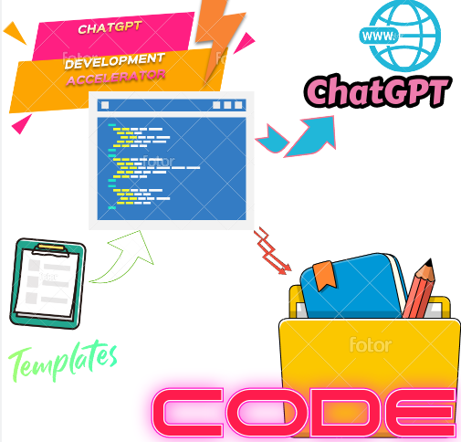
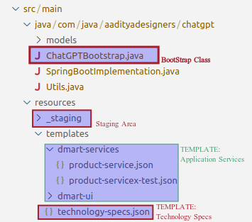
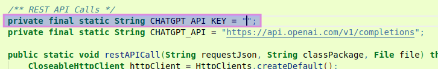
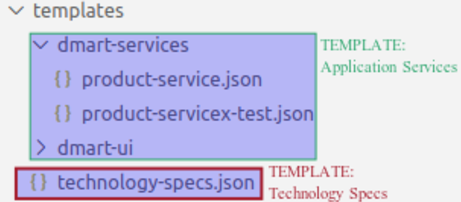
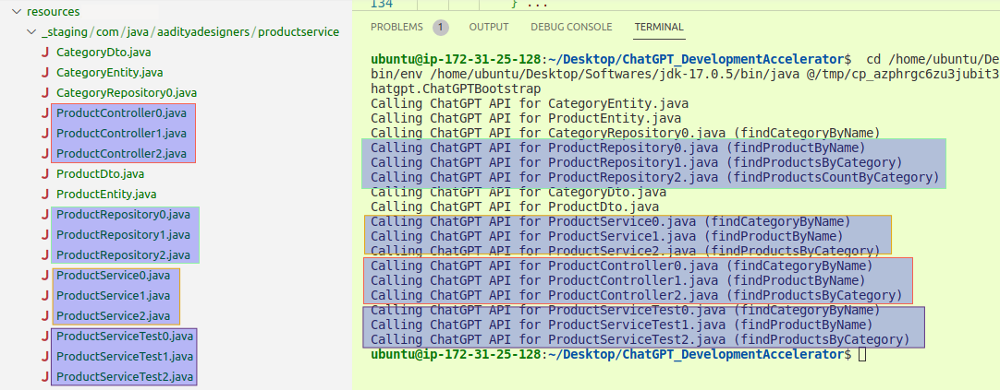

# [GenieAI] Application code auto generation using ChatGPT AI

>Version 1

This project is a generic application code generator using the ChatGPT AI services.

## Application Code Generator Engine

<br/><i>This <b>ChatGPTDevelopmentAccelerator</b> module uses the user-defined project templates (containing detailed technical components) to make a call to the ChatGPT API. ChatGPT in response sends the application code which is then downloaded to the _staging folder.</i> 
<br/>

1. The standalone Bootstrap class is located in the 
   - 'src/main/java/com/java/aadityadesigners/_chatgpt/<b>ChatGPTBootstrap.java</b>' class.

2. It uses the templates to construct the appropriate commands so as to call the ChatGPT API.
   - 'src/main/resources/<b><i>templates</i></b>' folder. 

    From here the developer can configure the template by adding the requirement as per his need.

    > <i>NOTE: In the next version, this manual editing of template will be replaced by intuitive User Interface (UI), from where the developer can simply fill in the form in a more simple way.</i>

3. The application code files are finally downloaded to the below staging location.
   - 'src/main/resources/<b><i>_staging</i></b>' folder.

    From here the developer can copy the files to his/her project directory. Just few adjustments needs to be made for the code to work correctly.

    
<br/><br/>

### 1. ChatGPTBootstrap
It is the main class which creates the commands and then calls the ChatGPT API to get the code and then downloads it to the <i>_staging</i> folder.

NOTE: Create the ChatGPT API key and place it in the below java utility class.
[link](src/main/java/com/java/aadityadesigners/chatgpt/Utils.java)
<br/>
API_KEY: https://beta.openai.com/account/api-keys


<br/><br/>
### 2. Templates

<br/>They play very important role to construct the command for the ChatGPT AI since there is a strict limitation on the length of words(i.e. tokens) to be sent to the ChatGPT API. The templates are categorized into two types i.e.
- Technology Specs <i>(i.e. technology-specs.json)</i>
- Application Services <i>(e.g $usecase-service.json)</i>

<br/><i>NOTE:
Since the process of the templates are dynamic therefore if there are dependencies on their execution then the templates should be named to fall in the alphabetically order as shown above. (i.e. the test template has been added a suffix 'x' to move it to the end)</i>
<br/><br/>

#### 2.1 Technology Specs
The defines the tech stack used in the project so that ChatGPT AI can give the code relevant to that technology only.
> src/main/resources/templates/technology-specs.json
[link](src/main/resources/templates/technology-specs.json)
> <br/>{<br/>
    &nbsp;&nbsp;&nbsp;&nbsp;<b><i>"entity"</b></i>: "Use <b>Spring Boot Data JPA</b> with <b>Lombok</b> and <b>Javax validations</b>; please show Java code (including imports) for ",<br/>
    &nbsp;&nbsp;&nbsp;&nbsp;<b><i>"repository"</b></i>: "Use previous Entity class and <b>Spring Boot Data JPA</b> (without EntityManager) with <b>Exception Handling</b>; please show the Repository Java code (including imports) for ",<br/>
    &nbsp;&nbsp;&nbsp;&nbsp;<b><i>"dto"</b></i>: "Use <b>Lombok</b> and <b>Javax validations</b>; please show the Java DTO code (including imports, if needed) for ",<br/>
    &nbsp;&nbsp;&nbsp;&nbsp;<b><i>"service"</b></i>: "Use previous Entity class, Repository class, and <b>Spring Boot</b> with <b>Exception Handling</b> and <b>Transactional Support</b>; please show the Service Java code (including imports) for ",<br/>
    &nbsp;&nbsp;&nbsp;&nbsp;<b><i>"controller"</b></i>: "Use previous Service class and <b>Spring Boot REST API</b>; please show the Java Controller code (including imports) for "<br/>
}

<br/>

#### 2.2 Application Services
The exact project code components requirements is defined in this json file.
> src/main/resources/templates/
[link](src/main/resources/templates/) 

<i>NOTE: <br/>
&nbsp;&nbsp;&nbsp;&nbsp;It can be observed here that in the <b>"processing-logic"</b> tag, you can define your business logic in words which the ChatGPT AI will convert it to relevant code automatically.</i><br/>
&nbsp;&nbsp;&nbsp;&nbsp;Also <b>"input"/"output"</b> parameters can be defined in order to get more correct code.

```json
{
    "basePackage": "com.java.aadityadesigners.productservice",
    "entity": [{
        "name": "CategoryEntity",
        "table": "Category",
        "attributes": [
            {"name": "id", "type": "Long"},
            {"name": "name", "type": "String"}
        ]} ...
    ],
    "repository": [{
        "name": "ProductRepository",
        "method": [
            {
                "name": "findProductsByCategory",
                "input": ["CategoryEntity categoryEntity"],
                "output": "List<ProductEntity>",                
                "processing-logic": "Find the list of ProductEntity by CategoryEntity"
            },
            {
                "name": "findProductsCountByCategory",
                "input": ["CategoryEntity categoryEntity"],
                "output": "Integer",                 
                "processing-logic": "Find the total count of ProductEntity by CategoryEntity."                    
            } ...             
        ]} ...
    ],
    "dto": [{
        "name": "ProductDto",
        "attributes": [
            {"name": "name", "type": "String"},
            {"name": "category", "type": "CategoryDto"},
            {"name": "sku", "type": "String", "regex": "Size should be between 5 to 10 characters long."}
        ]} ...
    ],    
    "service": [{
        "name": "ProductService",
        "function": [
            {
                "name": "findProductsByCategory",
                "input": ["CategoryDto categoryDto"],
                "output": "List<ProductDto>",                
                "processing-logic": "Find list of ProductDto by CategoryDto using ProductRepository. Use ModelMapper to convert between DTO and Entity class."
            } ...          
        ]} ...
    ],  
    "controller": [{
        "name": "ProductController",
        "function": [
            {
                "name": "findProductsByCategory",
                "input": ["CategoryDto categoryDto"],
                "output": "List<ProductDto>",                      
                "processing-logic": "Find the list of ProductDto by CategoryDto using ProductService."
            } ...
        ]} ...
    ]      

```
<br/><br/>

### 2.3 Staging Folder
All the project files created by the ChatGPT AI can be found as under. You just need to do small edit to make it inline with your project setup. In the sample 'Product Services', these are the list of files as shown in the snapshot below.<br/><br/>

> <i>NOTE: Here, the files are downloaded in <u>multi-part</u> fashion because of the severe limitation of the ChatGPT download code size. Later the multi-part files are merged into one or the developer can copy it one by one.</i><br/>


<br/><br/>
> Code Analysis<br/>

<i>Also, as stated earlier that the ChatGPT AI automatically created the codes according to the provided business logic and it can be verified below.<br/>
<b><u>product-service.json</u><br/></b>
ProductRepository<br/>
&nbsp;&nbsp;&nbsp;&nbsp;-> findProductsCountByCategory<br/>
&nbsp;&nbsp;&nbsp;&nbsp;&nbsp;&nbsp;&nbsp;"processing-logic": "Find the total <b>count</b> of ProductEntity by CategoryEntity."<br/>

<b><u>ProductRepository.java</u><br/></b>
```java
public interface ProductRepository extends JpaRepository<ProductEntity, Long> {
   Integer findProductsCountByCategory(CategoryEntity categoryEntity);
}
```
Here it can be seen that ChatGPT has used Spring Data JPA inline method functions to compute the <b>count</b>. Also, sometimes the ChatGPT will use @Query annotation instead of this method. It is totally random on the solutions given by the ChatGPT AI.
<br/><br/>

<b><u>product-service.json</u><br/></b>
ProductService<br/>
&nbsp;&nbsp;&nbsp;&nbsp;-> findProductsCountByCategory<br/>
&nbsp;&nbsp;&nbsp;&nbsp;&nbsp;&nbsp;&nbsp;"processing-logic": "Find list of ProductDto by CategoryDto using ProductRepository. Use <b>ModelMapper</b> to convert between DTO and Entity class."<br/>

<b><u>ProductService.java</b></u>
```java
@Autowired
private ProductRepository productRepository;

@Autowired
private ModelMapper modelMapper;

@Transactional
public List<ProductDto> findProductsByCategory(CategoryDto categoryDto) {
    List<Product> products = productRepository.findByCategory(categoryDto.getId());
    List<ProductDto> productDtos = new ArrayList<ProductDto>();
    for(Product product : products) {
        ProductDto productDto = modelMapper.map(product, ProductDto.class);
        productDtos.add(productDto);
    }
    return productDtos;
}
```
It can be seen here that the ChatGPT API has used <b>ModelMapper</b> utility for DTO to Entity conversion automatically with the correct methods.

<br/><br/>
> WORKING VIDEO...<br/>

<strike>ChatGPT_Demo1v2<br/>
https://drive.google.com/file/d/1t92OPwrkuusYW56bCkakjIZDSZXBvQc2/view
</strike>
ChatGPT_Demo1v3<br/>
https://drive.google.com/file/d/1noslYNBnFW_jP_dIwVnwJ3uUoQBp8Hp4/view

ChatGPT_Demo2<br/>
https://drive.google.com/file/d/1y_Px3JRluYQu8voWD0skCM36N1ASloAJ/view
